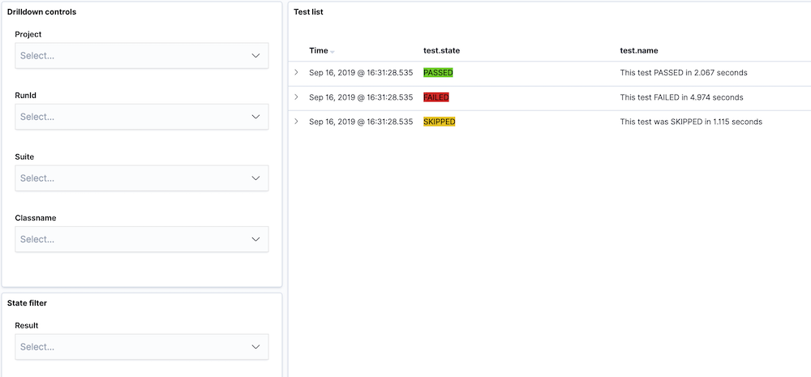
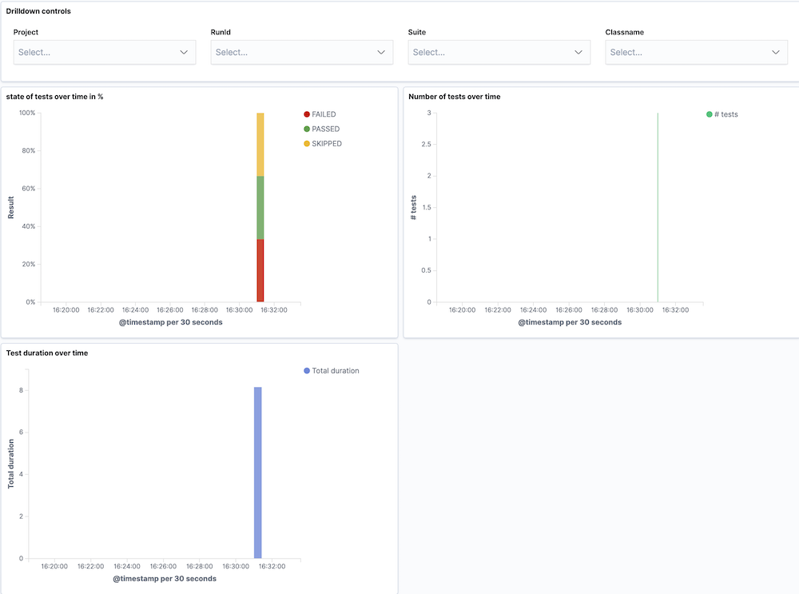

# Testingbeat
Testingbeat reads test result files (e.g. Junit xml files) and sends them to elasticsearch. It also provides out of the box dashboards. 

## Usage
Testingbeat can be configured to watch a folder for new files which it then parses with a defined test result parser (currently only junit is available).

Junit files are broken up to create one document per test case instead of the junit model of one document (file) per suite/group.
You can also specify additional metadata that will be added to each test result document.

### Setup
Testingbeat ships with a default index-pattern and dashboards for Kibana. To automatically add them to your Kibana installation first add your elastic stack deployment including username and password to `testingbeat.yml`
Then you can run `testingbeat setup`





### Configuration
Testingbeat is primarily configured via `testingbeat.yml`. 
There is an additional file `runconfig.yml` that contains optional fields of metadata that will be added to a test result.

#### testingbeat.yml
Additionally to the default fields of any Beat there are three fields specific to Testingbeat:
- `path` Specifies the path to a folder where Testingbeat looks for created files
- `type` The type of testresult file that should get parsed, currently only `junit` is supported
- `runconfig` Path to the `runconfig.yml` config file (see below)

#### runconfig.yml
In addition to the values read from test result files Testingbeat will read additional, project specific variables from the `runconfig.yml` file.
`runconfig.yml` is read before every result file (like an xml Junit file) and adds the variables to the test result that will be send to Elasticsearch.
This means you can change the values while Testingbeat is running and any changes will be picked up - this can be useful e.g. when you want to change some metadata on different stages of our CI process. 

Currently the following fields are supported:
- `runid` This field is meant to contain a unique id identifying a single test execution (like a run id of a Jenkins execution) 
- `environment` Meant to specify an execution environment, typically something like `staging` or `development`
- `project` Can be used to specify an arbitrary project name, which is useful for grouping results
- `link` A full link to e.g. the execution results (like a CI job that executed the tests) 
- `runner` Meant to spcify how the test was executed, for example could be `local` or `jenkins`
- `owner` Can be used to specify an owner of the tests or execution, this could be a team or a person
- `startedby` Meant to specify who or what started the tests 


## Development

Ensure that this folder is at the following location:
`${GOPATH}/src/github.com/vaubarth/testingbeat`

### Requirements

* [Golang](https://golang.org/dl/) 1.7

### Init Project
To get running with Testingbeat and also install the
dependencies, run the following command:

```
make setup
```

It will create a clean git history for each major step. Note that you can always rewrite the history if you wish before pushing your changes.

To push Testingbeat in the git repository, run the following commands:

```
git remote set-url origin https://github.com/vaubarth/testingbeat
git push origin master
```

For further development, check out the [beat developer guide](https://www.elastic.co/guide/en/beats/libbeat/current/new-beat.html).

### Build

To build the binary for Testingbeat run the command below. This will generate a binary
in the same directory with the name testingbeat.

```
make
```


### Run

To run Testingbeat with debugging output enabled, run:

```
./testingbeat -c testingbeat.yml -e -d "*"
```


### Test

To test Testingbeat, run the following command:

```
make testsuite
```

alternatively:
```
make unit-tests
make system-tests
make integration-tests
make coverage-report
```

The test coverage is reported in the folder `./build/coverage/`

### Update

Each beat has a template for the mapping in elasticsearch and a documentation for the fields
which is automatically generated based on `fields.yml` by running the following command.

```
make update
```


### Cleanup

To clean  Testingbeat source code, run the following command:

```
make fmt
```

To clean up the build directory and generated artifacts, run:

```
make clean
```


### Clone

To clone Testingbeat from the git repository, run the following commands:

```
mkdir -p ${GOPATH}/src/github.com/vaubarth/testingbeat
git clone https://github.com/vaubarth/testingbeat ${GOPATH}/src/github.com/vaubarth/testingbeat
```


For further development, check out the [beat developer guide](https://www.elastic.co/guide/en/beats/libbeat/current/new-beat.html).


## Packaging

The beat frameworks provides tools to crosscompile and package your beat for different platforms. This requires [docker](https://www.docker.com/) and vendoring as described above. To build packages of your beat, run the following command:

```
make release
```

This will fetch and create all images required for the build process. The whole process to finish can take several minutes.
